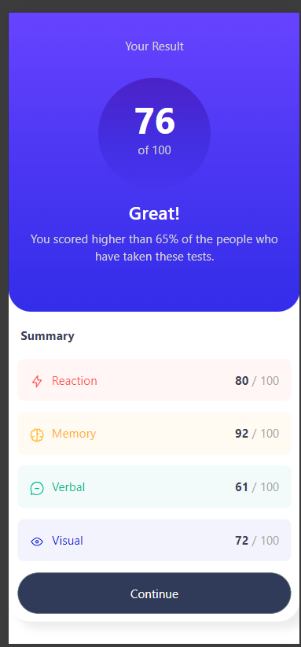
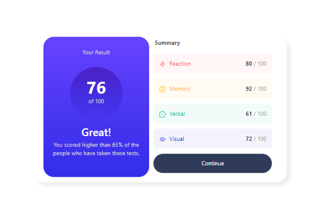
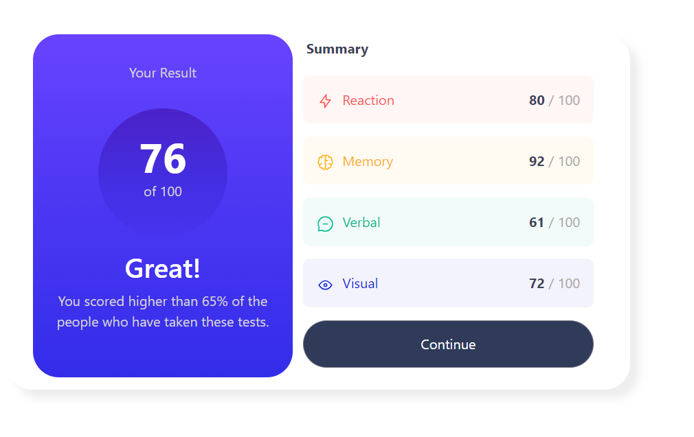
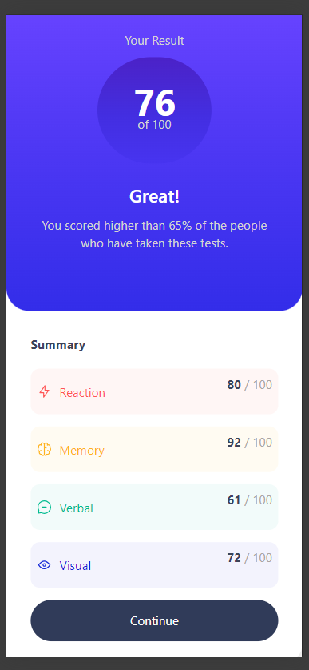
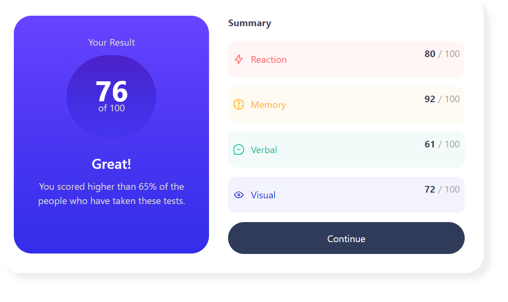

# Reto de HTML y CSS con Bootstrap y TailwindCSS

Este proyecto consiste en resolver un reto de HTML y CSS dos veces, una utilizando el framework Bootstrap y otra utilizando TailwindCSS. El objetivo principal es crear dos versiones del mismo diseño, siendo lo más parecidas posible al diseño original.

## Solucion con Bootstrap
**Mobile Portrait (320px X 480px)**

 

**Tablet portrait (768px x 1024px)**

 

**Desktop(1024px)**

 

## Link de la Pagina Web

[link de la pagina](https://dsaw-2024-1.github.io/css-frameworks-ValeRuizTo/)

https://dsaw-2024-1.github.io/css-frameworks-ValeRuizTo/

## Solucion con Tailwind
**Mobile Portrait (320px X 480px)**

 

**Tablet portrait (768px x 1024px)**

 

**Desktop(1024px)**

 

## Contexto

El reto de HTML y CSS implica crear una página web responsive utilizando diferentes frameworks de estilos. Las imágenes necesarias para el diseño se encuentran dentro de la carpeta `assets`, mientras que los diseños de la página están ubicados en la carpeta `design`.

## Requisitos

- Resolver el reto dos veces, una vez utilizando Bootstrap y otra vez utilizando TailwindCSS.
- Asegurarse de que el producto visual sea lo más parecido posible al diseño original.
- La página debe ser responsive y verse bien en dispositivos móviles, tabletas y escritorio.

- [Documentación de TailwindCSS](https://tailwindcss.com/docs)
- [Guía de diseño web responsive](https://www.w3schools.com/html/html_responsive.asp)
